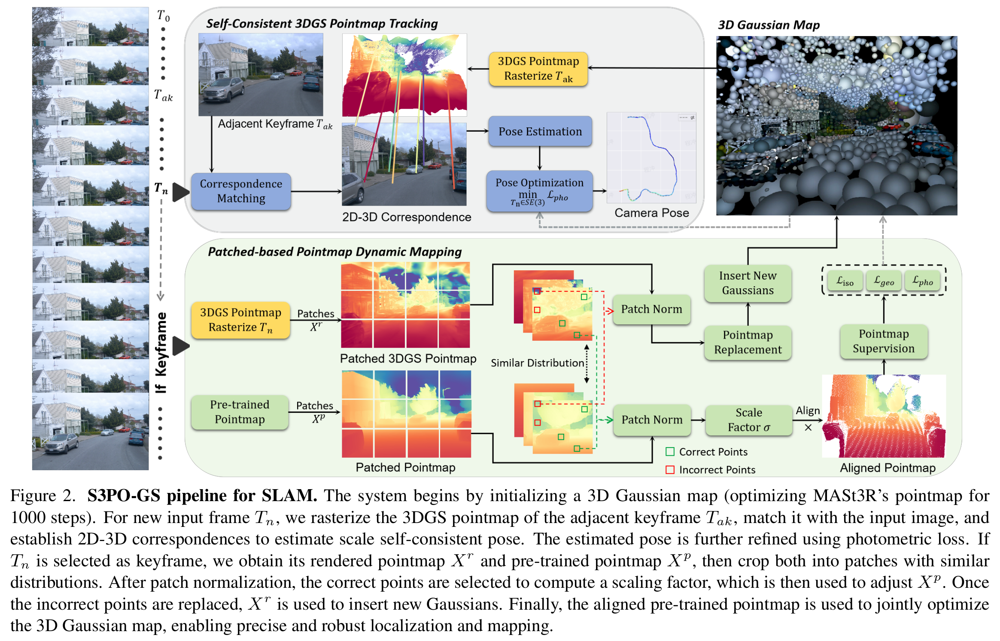

# S3PO-GS SLAM

{ width=100% style="display: block; margin: 0 auto;" }

之前的 3DGS SLAM 在纯 RGB 输入的室外场景面临缺乏几何先验信息（lacks geometric priors）和尺度漂移（scale drift）的问题。一方面，之前的 3DGS SLAM 通过光度误差的反向传播优化相机位姿，但是由于缺乏几何先验，相机位姿的优化容易陷入局部最小值；另一方面，为了加强几何约束，Photo-SLAM 和 MGS-SLAM 分别引入独立的 ORB-SLAM3 跟踪模块和 Multi-View Stereo (MVS) network 预训练模型来补充几何信息，增强姿态估计的鲁棒性，但是这种策略需要保持外部模块和 3DGS 地图之间的比例对齐 —— 这在室内场景是容易做到的，但在旋转和位移较大的场景下，累积误差容易导致 SLAM 系统的尺度漂移，降低后续的姿态估计和地图重建质量。

{ width=100% style="display: block; margin: 0 auto;" }

&nbsp;

[1] [Cheng C, Yu S, Wang Z, et al. Outdoor monocular slam with global scale-consistent 3d gaussian pointmaps[J]. arXiv preprint arXiv:2507.03737, 2025.](https://3dagentworld.github.io/S3PO-GS/)
