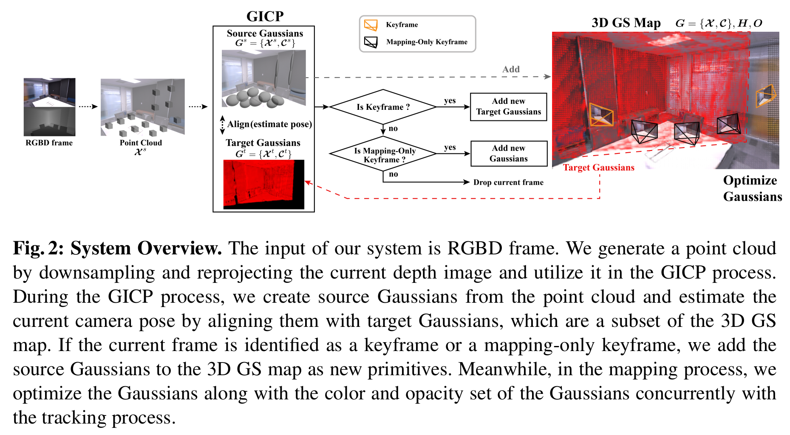

# GS-ICP SLAM

最开始的 SplaTAM、Gaussian Splatting SLAM 和 GS-SLAM 都采用了高斯椭球参数和相机位姿通过光度误差反向传播联合优化的紧耦合方式，但这显然限制了 SLAM 前端的跟踪速度；后续的 Photo-SLAM 则采用了 Tracking 线程复用 ORB-SLAM、Mapping 线程利用 3DGS 精细化建图的松耦合架构。GS-ICP SLAM[[1]](#GS-ICP-SLAM-paper) 则提出说 G-ICP（Generalized Iterative nearest Point，广义迭代最近点）算法可以直接将 3DGS 用于 Tracking 线程，如此既免去了紧耦合中光度误差反向优化的计算量，又不必如松耦合那般存储高斯地图以外的冗余特征。

{ width=100% style="display: block; margin: 0 auto;" }

## G-ICP Tracking

## GS Mapping

Tracking 线程只需几个有代表性的关键帧即可，过多的关键帧反而会产生累积误差，但 Mapping 线程却要求较多的关键帧来支持稠密建图。为了解决这个冲突，GS-ICP SLAM 中 Tracking 和 Mapping 的关键帧并不是相同的，而是引入了 Mapping-Only Keyframe。

{ width=90% style="display: block; margin: 0 auto;" }

&nbsp;

[1] [Ha S, Yeon J, Yu H. Rgbd gs-icp slam[C]//European Conference on Computer Vision. Cham: Springer Nature Switzerland, 2024: 180-197.](https://github.com/Lab-of-AI-and-Robotics/GS_ICP_SLAM)
