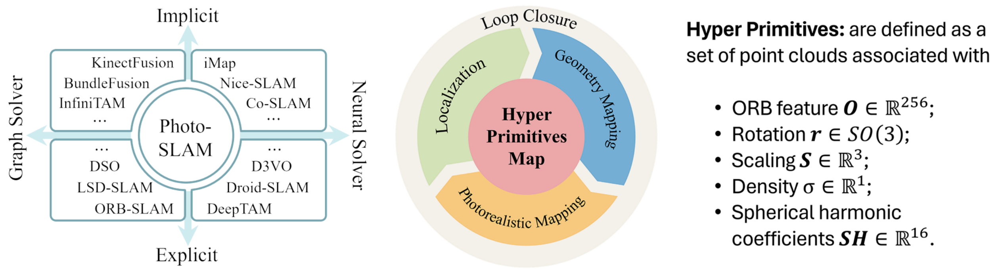

# Photo-SLAM: Monocular, Stereo and RGB-D

Nerf 神经辐射场对场景的隐式表示训练时间长，这与 SLAM 的实时性要求相矛盾，而 3DGS 的显式表示却可能缺乏高级的纹理信息，不利于高精度地图的构建。Photo-SLAM[<sup>[1]</sup>](#Photo-SLAM-paper) 则是用 Coarse-to-Fine 的方式结合了显隐式表达的优势：一方面使用超原语和 3DGS 技术来获得粗糙的地图和定位，另一方面使用增量式的高斯金字塔网络来优化地图细节并学习场景的高级特征。而 Photo-SLAM 的 Method 正是围绕下面右图的五部分展开的。

> Photo-SLAM is a novel framework maintaining a hyper primitives map: Explicit geometric features for efficient localization and geometry mapping solved by factor gragh, and Implicit photometric features for photorealistic mapping solved by backprogating the photometric loss, thus achieving high-quality mapping without reliance on dense depth information.

{ width=100% style="display: block; margin: 0 auto;" }

总体而言，Photo-SLAM Tracking 的实时性完全基于 ORB-SLAM3 的特征点法，只是在这个基础上多存储了一些高斯椭球参数，而 Mapping 其实也并没有真正地做到 Real-Time。Photo-SLAM 将建图分成两部分 —— 基于几何信息的和像素级的，前者完全基于 ORB-SLAM3，后者则会有一些滞后性 —— 首先重建出一个“粗地图”，这部分只是把 3DGS 原来通过 SfM 得到的点替换成超原语点输入到原来的 3DGS 流程中，从而得到一个不包含高级信息和细节的地图；然后通过网络得到一个“细地图”，同时因为网络是用三层高斯金字塔结构，所以速度上不会太慢。某种意义上说，ORB-SLAM3 + 3DGS + 三层金字塔网络 = Photo-SLAM，前两者保证实时跟踪和建图，后者在不拖延时间的基础上尽可能地提升建图的精度[<sup>[2]</sup>](#Photo-SLAM-explanation)。

<!-- ## Hyper Primitives Map -->

## Localization and Geometry Mapping

$$
\small\{\mathbf{R},\mathbf{t}\}=\underset{\mathbf{R},\mathbf{t}}{\arg\min}\sum_{i\in\mathcal{X}}\rho\left(\|\mathbf{p}_i-\pi(\mathbf{R}\mathbf{P}_i+\mathbf{t})\|_{\Sigma_g}^2\right), \thinspace\thinspace\thinspace\thinspace\thinspace \{\mathbf{P}_i,\mathbf{R}_l,\mathbf{t}_l|i\in\mathcal{P}_L,l\in\mathcal{K}_L\}=\underset{\mathbf{P}_i,\mathbf{R}_l,\mathbf{t}_l}{\arg\min}\sum_{\begin{array}{c}k\in\mathcal{K}\end{array}}\sum_{\begin{array}{c}j\in\mathcal{X}_k\end{array}}\rho(E(k,j))
$$

## Photorealistic Mapping

像素级的建图自然离不开 3D-2D 抛雪球的过程，而 Photo-SLAM 沿射线的体渲染公式与 3DGS 类似：

$$
\small C(\mathbf{R},\mathbf{t})=\sum_{i\in \mathcal{N}}\mathbf{c}_i\alpha_i\prod_{j=1}^{i-1}(1-\alpha_i)
$$

其中 $\small N$ 是超基元的数量，$\small\mathbf{c}_i$ 表示由球谐系数 $\small\mathbf{SH}\in\mathbb{R}^{16}$ 转换得到的颜色，$\small\alpha_i$ 为 $\small\sigma_i\cdot\mathcal{G}(\mathbf{R},\mathbf{t},\mathbf{P}_i,\mathbf{r}_i,\mathbf{s}_i)，\mathcal{G}$ 代表高斯泼溅算法。而高斯均值 $\small\mathbf{P}$、旋转矩阵 $\small\mathbf{r}$、缩放矩阵 $\small\mathbf{s}$、椭球密度 $\small\sigma$ 和球谐系数 $\small\mathbf{SH}$ 这些参数的优化则是通过最小化渲染出的图像和真实图像间的光度误差实现的。公式如下所示，也可以在 Photo-SLAM 一轮训练的代码中找到。

$$
\small\mathcal{L}=(1-\lambda)\left|I_\mathrm{r}-I_\mathrm{gt}\right|_1+\lambda(1-\mathrm{SSIM}(I_\mathrm{r},I_\mathrm{gt}))
$$

``` C++ hl_lines="4-8"
/* src/gaussian_mapper.cpp */
void GaussianMapper::trainForOneIteration()
    ...
    // Loss
    auto Ll1 = loss_utils::l1_loss(masked_image, gt_image);
    float lambda_dssim = lambdaDssim();
    auto loss = (1.0 - lambda_dssim) * Ll1
                + lambda_dssim * (1.0 - loss_utils::ssim(masked_image, gt_image, device_type_));
    loss.backward();
```

类似于 3DGS 的自适应密度控制，Photo-SLAM 建图时自然要对一开始的粗原语作致密化操作。注意到 3DGS 原先 Colmap 初始化的点云对高斯椭球的空间几何约束是较弱的，高斯椭球在后续优化中可以自由浮动，而 ORB-SLAM 的特征点则起到了对场景结构的锚定作用。Photo-SLAM 认为分布在图像上的二维特征点实际上标记出了场景中具有复杂纹理的区域，所以除了 3DGS 基于拟合梯度的克隆和分裂外（如下述代码所示），Photo-SLAM 还考虑了在特征点附加的致密化。这种用 ORB 特征点作锚点的思想也是后续被 SEGS-SLAM 所借鉴的一点。

//// collapse-code
``` C++ hl_lines="17-22 44-47"
/* src/gaussian_mapper.cpp */
void GaussianMapper::trainForOneIteration()
    ...
        // Densification
        if (getIteration() < opt_params_.densify_until_iter_) {
            // Keep track of max radii in image-space for pruning
            gaussians_->max_radii2D_.index_put_(
                {visibility_filter},
                torch::max(gaussians_->max_radii2D_.index({visibility_filter}),
                            radii.index({visibility_filter})));
            // if (!isdoingGausPyramidTraining() || training_level < num_gaus_pyramid_sub_levels_)
                gaussians_->addDensificationStats(viewspace_point_tensor, visibility_filter);

            if ((getIteration() > opt_params_.densify_from_iter_) &&
                (getIteration() % densifyInterval()== 0)) {
                int size_threshold = (getIteration() > prune_big_point_after_iter_) ? 20 : 0;
                gaussians_->densifyAndPrune(
                    densifyGradThreshold(),
                    densify_min_opacity_,//0.005,//
                    scene_->cameras_extent_,
                    size_threshold
                );
            }

            if (opacityResetInterval()
                && (getIteration() % opacityResetInterval() == 0
                    ||(model_params_.white_background_ && getIteration() == opt_params_.densify_from_iter_)))
                gaussians_->resetOpacity();
        }

        auto iter_end_timing = std::chrono::steady_clock::now();
        auto iter_time = std::chrono::duration_cast<std::chrono::milliseconds>(
                        iter_end_timing - iter_start_timing).count();

/* src/gaussian_model.cpp */
void GaussianModel::densifyAndPrune(
    float max_grad,
    float min_opacity,
    float extent,
    int max_screen_size)
{
    auto grads = this->xyz_gradient_accum_ / this->denom_;
    grads.index_put_({grads.isnan()}, 0.0f);
    this->densifyAndClone(grads, max_grad, extent);
    this->densifyAndSplit(grads, max_grad, extent);

    auto prune_mask = (this->getOpacityActivation() < min_opacity).squeeze();
    if (max_screen_size) {
        auto big_points_vs = this->max_radii2D_ > max_screen_size;
        auto big_points_ws = std::get<0>(this->getScalingActivation().max(/*dim=*/1)) > 0.1f * extent;
        prune_mask = torch::logical_or(torch::logical_or(prune_mask, big_points_vs), big_points_ws);
    }
    this->prunePoints(prune_mask);

    c10::cuda::CUDACachingAllocator::emptyCache(); // torch.cuda.empty_cache()
}
```
////

## Gaussian-Pyramid-Based Learning

利用 OEB-SLAM3 和 3DGS 得到粗地图后，Photo-SLAM 通过三层高斯金字塔网络来优化地图细节，下面代码高亮的部分展示了网络层数、图像分辨率和球谐函数阶数的设置。

{ width=55% style="display: block; margin: 0 auto;" }

//// collapse-code
``` C++ hl_lines="19-35 40-42 46"
/* src/gaussian_mapper.cpp */
void GaussianMapper::trainForOneIteration()
{
    increaseIteration(1);
    auto iter_start_timing = std::chrono::steady_clock::now();

    // Pick a random Camera
    std::shared_ptr<GaussianKeyframe> viewpoint_cam = useOneRandomSlidingWindowKeyframe();
    if (!viewpoint_cam) {
        increaseIteration(-1);
        return;
    }

    writeKeyframeUsedTimes(result_dir_ / "used_times");

    // if (isdoingInactiveGeoDensify() && !viewpoint_cam->done_inactive_geo_densify_)
    // increasePcdByKeyframeInactiveGeoDensify(viewpoint_cam);

    int training_level = num_gaus_pyramid_sub_levels_;
    int image_height, image_width;
    torch::Tensor gt_image, mask;
    if (isdoingGausPyramidTraining())
        training_level = viewpoint_cam->getCurrentGausPyramidLevel();
    if (training_level == num_gaus_pyramid_sub_levels_) {
        image_height = viewpoint_cam->image_height_;
        image_width = viewpoint_cam->image_width_;
        gt_image = viewpoint_cam->original_image_.cuda();
        mask = undistort_mask_[viewpoint_cam->camera_id_];
    }
    else {
        image_height = viewpoint_cam->gaus_pyramid_height_[training_level];
        image_width = viewpoint_cam->gaus_pyramid_width_[training_level];
        gt_image = viewpoint_cam->gaus_pyramid_original_image_[training_level].cuda();
        mask = scene_->cameras_.at(viewpoint_cam->camera_id_).gaus_pyramid_undistort_mask_[training_level];
    }

    // Mutex lock for usage of the gaussian model
    std::unique_lock<std::mutex> lock_render(mutex_render_);

    // Every 1000 its we increase the levels of SH up to a maximum degree
    if (getIteration() % 1000 == 0 && default_sh_ < model_params_.sh_degree_)
        default_sh_ += 1;
    // if (isdoingGausPyramidTraining())
    //     gaussians_->setShDegree(training_level);
    // else
        gaussians_->setShDegree(default_sh_);

    // Update learning rate
    if (pSLAM_) {
        int used_times = kfs_used_times_[viewpoint_cam->fid_];
        int step = (used_times <= opt_params_.position_lr_max_steps_ ? used_times : opt_params_.position_lr_max_steps_);
        float position_lr = gaussians_->updateLearningRate(step);
        setPositionLearningRateInit(position_lr);
    }
    else {
        gaussians_->updateLearningRate(getIteration());
    }

    gaussians_->setFeatureLearningRate(featureLearningRate());
    gaussians_->setOpacityLearningRate(opacityLearningRate());
    gaussians_->setScalingLearningRate(scalingLearningRate());
    gaussians_->setRotationLearningRate(rotationLearningRate());

    // Render
    auto render_pkg = GaussianRenderer::render(
        viewpoint_cam,
        image_height,
        image_width,
        gaussians_,
        pipe_params_,
        background_,
        override_color_
    );
    auto rendered_image = std::get<0>(render_pkg);
    auto viewspace_point_tensor = std::get<1>(render_pkg);
    auto visibility_filter = std::get<2>(render_pkg);
    auto radii = std::get<3>(render_pkg);

    // Get rid of black edges caused by undistortion
    torch::Tensor masked_image = rendered_image * mask;

    // Loss
    auto Ll1 = loss_utils::l1_loss(masked_image, gt_image);
    float lambda_dssim = lambdaDssim();
    auto loss = (1.0 - lambda_dssim) * Ll1
                + lambda_dssim * (1.0 - loss_utils::ssim(masked_image, gt_image, device_type_));
    loss.backward();
```
////

## Loop Closure

> Loop Closure is crucial in SLAM because it helps address the problem of accumulated errors and drift that can occur during the localization and geometry mapping process. After detecting a closing loop, we can correct local keyframes and hyper primitives by similarity transformation. With corrected camera poses, the photorealistic mapping component can further get rid of the ghosting caused by odometry drifts and improve the mapping quality.[<sup>[1]</sup>](#Photo-SLAM-paper)


&nbsp;

<div id="Photo-SLAM-paper"></div>
[1] [Huang H, Li L, Cheng H, et al. Photo-slam: Real-time simultaneous localization and photorealistic mapping for monocular stereo and rgb-d cameras[C]//Proceedings of the IEEE/CVF Conference on Computer Vision and Pattern Recognition. 2024: 21584-21593.](https://huajianup.github.io/research/Photo-SLAM/)

<div id="Photo-SLAM-explanation"></div>
[2] [Bilibili 上的这个视频给出了 Photo-SLAM 人性化的讲解，也是我这篇笔记的来源。](https://www.bilibili.com/video/BV185ere5EYC/?spm_id_from=333.337.search-card.all.click&vd_source=df8c598e3026e471e571a5970603f409)