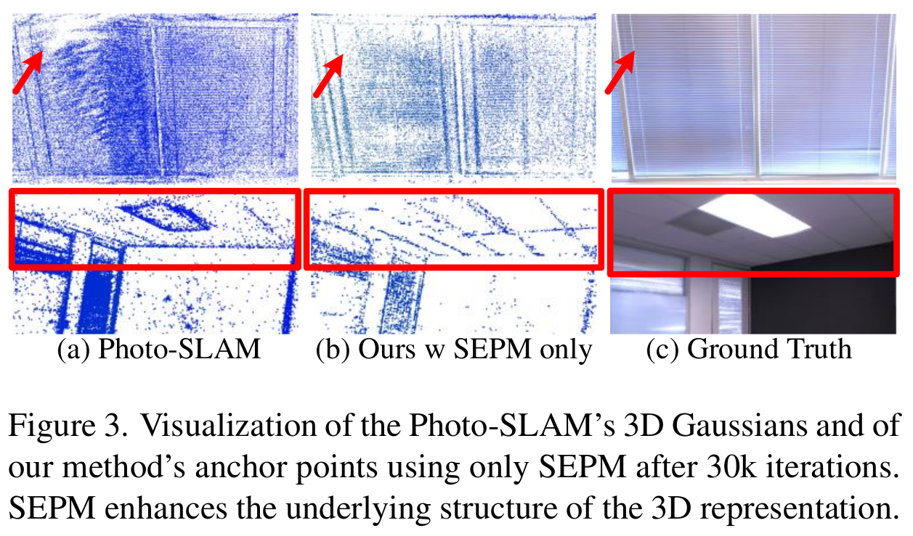

# SEGS-SLAM: SOTA

SEGS-SLAM[[1]](#SEGS-SLAM-paper) 强调对场景结构的利用，而这是被之前大多数 SLAM 算法所忽略的。如图 1 第二行所示，MonoGS 在重建梯子结构时呈现出明显杂乱的结构；Photo-SLAM 虽然利用了场景结构，在地图稠密化中引入了几何致密化模块，其高斯参数能以较少迭代次数收敛到相对较优的结果，但依然没有充分利用场景结构，如图 1 第二行所示，Photo-SLAM 对鼠标边缘的重建仍显模糊[[2]](#SEGS-SLAM-wechat)。

{ width=100% style="display: block; margin: 0 auto;" }

SEGS-SLAM 的框架与 Photo-SLAM 类似，都是先由 ORB-SLAM3 生成相机轨迹和点云粗地图，再通过金字塔网络优化地图细节（这容易让人联想到 SLAM 前后端的思想，即跟踪部分需要实时响应图像数据，而对地图的优化则没必要实时地计算，后段优化可以在后台慢慢进行），只是 SEGC-SLAM 更充分地利用了 ORB-SLAM3 重建点云的结构特性，且优化网络从高斯金字塔变成频谱金字塔了而已。具体说来，SEGS-SLAM 通过 ORB-SLAM3 的 Tracking & Mapping 得到相机位姿和点云后，一方面 Structure-Enhanced Photorealistic Mapping 将点云体素化得到锚点以保留场景结构，另一方面 Appearance-from-Motion Embedding（AfME，运动中外观嵌入）建立相机位姿到场景外观的映射以更好地捕捉不同视角下场景的光影变化。最后基于频率金字塔 Frequency Pyramid Regularization 对渲染的图像作监督训练，共同优化高斯椭球的参数和 AfME 的权值。

{ width=100% style="display: block; margin: 0 auto;" }

## 结构增强：ORB-SLAM3 点云体素化

在 Figure 3(a) 中，可以看到 Photo-SLAM 优化后的高斯点云呈杂乱一团，这是因为 colmap 或 ORB-SLAM 初始化的点云虽然提供了初始位置，但这些高斯点在后续优化中是自由浮动的，其结构约束很弱，容易为了拟合像素颜色而牺牲几何的准确性。SEGS-SLAM 利用锚点来保留 ORB-SLAM 生成点云的结构先验信息 —— 每个锚点负责管理其周围的 $k$ 个高斯椭球，即

$$
\small\left\{\mu_0,\ldots,\mu_{k-1}\right\}=\mathbf{t}_v+\left\{\mathcal{O}_0,\ldots,\mathcal{O}_{k-1}\right\}\cdot l_v
$$

其中 $\small\mu_j$ 是第 $\small j$ 个高斯椭球的中心位置，$\small\mathbf{t}_v$ 为锚点位置，$\small\mathcal{O}_{j}$ 和 $\small l_v$ 分别是可学习的偏移向量和缩放因子。

{ width=60% style="display: block; margin: 0 auto;" }

## 外观理解：不同视角的场景光影

{ width=70% style="display: block; margin: 0 auto;" }

## 渲染细节：频域金字塔正则化

SEGS-SLAM 利用多尺度表示来学习场景中的高频细节。设 $\small s\in\mathcal{S}=\{s_0,s_1,\cdots,s_n\}$ 代表图像的缩放率，二维快速傅里叶变换得到的频谱为 $\small\mathcal{F}(I_r^s)(u,v), \mathcal{F}(I_g^s)(u,v)$，高频损失的定义如下。其中 $\small F_{hf,r}^s(u,v), F_{hf,g}^s(u,v)$ 为 $\small H_{hf}(u,v)$ 高通滤波得到的高频分量，$\small\mathcal{N}=HW$ 表示图像的大小，$\small\lambda_s$ 代表各层金字塔损失的权重。

$$
\small\mathcal{L}_{hf}=\sum_{s\in\mathcal{S}}\frac{1}{\mathcal{N}}\lambda_s\sum_{u,v}\left|F_{hf,r}^s(u,v)-F_{hf,g}^s(u,v)\right|, \thinspace\thinspace\thinspace\thinspace\thinspace\thinspace F_{hf,i}^s(u,v)=H_{hf}(u,v)\cdot\mathcal{F}(I_i^s)(u,v), \thinspace\thinspace\thinspace i\in\{r,g\}
$$

&nbsp;

[1] [Wen, Tianci et al. “SEGS-SLAM: Structure-enhanced 3D Gaussian Splatting SLAM with Appearance Embedding.” (2025).](https://segs-slam.github.io/)

[2] [“结构增强+外观嵌入：SEGS-SLAM如何让3D高斯建图实现前所未有的照片级真实感？”这篇微信公众号推文给出了通俗的论文概述，可供参考。](https://mp.weixin.qq.com/s/zSWgHOikmFTZ85XUQyfT9w)