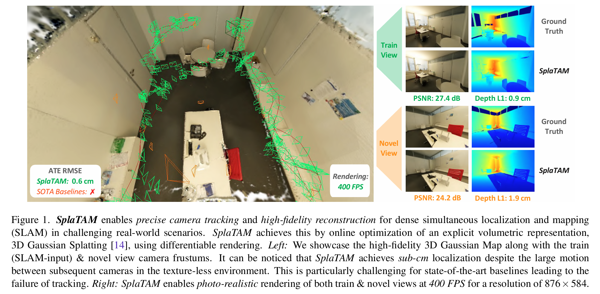

# SplaTAM：Splat, Track & Map

为什么 3DGS 可以应用在 SLAM 中呢？粗糙地看，SLAM 中有 2D-3D 建图，也有 3D-2D BA 重投影消除相机位姿估计累积误差的过程，这与 3DGS 中 2D-3D 的 SfM 和 3D-2D 的误差反向传播类似。毕竟是首篇开源的 3DGS-SLAM 论文，SplaTAM[<sup>[1]</sup>](#SplaTAM-paper) 依然在 Nerf 隐式和 3DGS 显式快速建图的语境下谈高保真的场景重建 —— 隐式神经场表示面临计算效率低、不易编辑、不能明确模拟空间几何特征和灾难性遗忘的问题，那么与之相对的，SplaTAM 自然要回答如何在 SLAM 中嵌入 3DGS 技术：

> In this context, we explore the question, “How can one use an explicit volumetric representation to design a SLAM solution?” Specifically, we use a radiance field based on 3D Gaussians to Splat (Render), Track, and Map for SLAM. We believe that this representation has the following benefits over existing map representations:

1. Fast rendering and rich optimization：可想而知，高斯泼溅的一大优势便是可以快速渲染场景，而为了进一步提高 3DGS 的渲染速度，SplaTAM 去除了椭球外观对观测视角的依赖及其各向异性，即将球谐函数系数矩阵简化为 RGB 值 $\small c\in\mathbb{R}^3$，将协方差简化为球半径 $\small r$，从而得到高斯椭球的简化表示 $\small f(x)=o\exp(-||x-\mu||^2/2r^2)$，其中 $\small\mu\in\mathbb{R}^3$ 为高斯球均值，$\small o\in[0,1]$ 表示不透明度；同时，SplaTAM 仅在当前图像的可见范围内优化高斯椭球，类比像素 $\small p=(u,v)$ 的颜色渲染公式 $\small C(p)=\sum_{i=1}^nc_if_i(p)\prod_{j=1}^{i-1}( 1-f_j(p) )$，SplaTAM 引入深度损失 $\small D(p)=\sum_{i=1}^nd_if_i(p)\prod_{j=1}^{i-1}( 1-f_j(p) )$ 和像素可见性 $\small S(p)=\sum_{i=1}^nf_i(p)\prod_{j=1}^{i-1}( 1-f_j(p) )$，即该像素是否包含当前视图的信息以获得图像中待优化部分的轮廓。

2. Maps with explicit spatial extent：SplaTAM 认为显式地图具有明确的空间范围，并可通过简单地添加高斯椭球来增加地图容量，允许在编辑部分场景时保持照片级的真实感渲染。正如由上面的像素可见性 $\small S(p)$ 定义的轮廓图，视图边界对于 SLAM 的相机跟踪显然是重要的，因为我们只希望将视图范围内的高斯椭球与新输入的 Ground Truth 图像作比较，而非像隐式建图那样每次都要优化全局的网络。

<!-- 3. Direct gradient flow to parameters：到参数的直接梯度流: 由于场景由具有物理3D位置、颜色和大小的高斯表示, 因此参数和渲染之间存在直接的、几乎线型的梯度流. 而隐式神经表示的优化则需要流经多层非线性网络层. -->

{ width=100% style="display: block; margin: 0 auto;" }

> SplaTAM 中对球谐函数系数矩阵的简化可能直接借鉴了 Gaussian Splatting SLAM 9.3. Effect of Spherical Harmonics (SH) 消融实验的结论，而深度损失的引入则与 Gaussian Splatting SLAM 3.3.1. Tracking 类似。

## Tracking：可见轮廓内的颜色深度误差

SplaTAM 使用匀速模型 $\small E_{t+1} = E_t + (E_t-E_{t-1})$ 初始化相机位姿，也就是说前两帧和当前帧的相机位姿构成了等差数列，这一点在下面的 `initialize_camera_pose` 函数中是显而易见的。

//// collapse-code
```Python hl_lines="8"
''' scripts/spatam.py '''
def rgbd_slam(config: dict):
    ...
        # Initialize the camera pose for the current frame
        if time_idx > 0:
            params = initialize_camera_pose(params, time_idx, forward_prop=config['tracking']['forward_prop'])

def initialize_camera_pose(params, curr_time_idx, forward_prop):
    with torch.no_grad():
        if curr_time_idx > 1 and forward_prop:
            # Initialize the camera pose for the current frame based on a constant velocity model
            # Rotation
            prev_rot1 = F.normalize(params['cam_unnorm_rots'][..., curr_time_idx-1].detach())
            prev_rot2 = F.normalize(params['cam_unnorm_rots'][..., curr_time_idx-2].detach())
            new_rot = F.normalize(prev_rot1 + (prev_rot1 - prev_rot2))
            params['cam_unnorm_rots'][..., curr_time_idx] = new_rot.detach()

            # Translation
            prev_tran1 = params['cam_trans'][..., curr_time_idx-1].detach()
            prev_tran2 = params['cam_trans'][..., curr_time_idx-2].detach()
            new_tran = prev_tran1 + (prev_tran1 - prev_tran2)
            params['cam_trans'][..., curr_time_idx] = new_tran.detach()

        else:
            # Initialize the camera pose for the current frame
            params['cam_unnorm_rots'][..., curr_time_idx] = params['cam_unnorm_rots'][..., curr_time_idx-1].detach()
            params['cam_trans'][..., curr_time_idx] = params['cam_trans'][..., curr_time_idx-1].detach()
    
    return params
```
////

至于 Traking 优化位姿的部分则是在保持高斯椭球参数固定的情况下在可见轮廓图中最小化深度和颜色损失函数，公式如下所示。类比 ORB-SLAM 中的 Tracking 线程负责对每幅新来的图像提取 ORB 特征点，并与最近的关键帧进行比较，计算特征点的位置并粗略估计相机位姿，某种意义上 Tracking 部分的高斯椭球就相当于特征点，但这是高精度地图及其颜色深度信息所带来的密集型优化。

$$
\small\mathcal{L}_t = \sum\limits_p\bigg( S(p)>0.99 \bigg)\bigg( \mathcal{L}_1\big(D(p)\big) + 0.5\mathcal{L}_1\big(C(p)\big) \bigg)
$$

损失函数计算的代码如下。另外，相比 Gaussian Splatting SLAM 中对相机位姿优化最小雅可比矩阵的推导（类似于 BA 中观测相机方程关于相机位姿与特征点两个导数矩阵的推导），SplaTAM 并没有显式计算相机位姿的梯度，而是直接借用了 Pytorch 的自动微分操作 —— 结合下文可知，SplaTAM 的理论性很弱而手动设计的规则较多。

//// collapse-code
``` Python hl_lines="44 62-78 127-128"
''' scripts/spatam.py '''
def get_loss(params, curr_data, variables, iter_time_idx, loss_weights, use_sil_for_loss,
             sil_thres, use_l1, ignore_outlier_depth_loss, tracking=False, 
             mapping=False, do_ba=False, plot_dir=None, visualize_tracking_loss=False, tracking_iteration=None):
    # Initialize Loss Dictionary
    losses = {}

    if tracking:
        # Get current frame Gaussians, where only the camera pose gets gradient
        transformed_gaussians = transform_to_frame(params, iter_time_idx, 
                                             gaussians_grad=False,
                                             camera_grad=True)
    elif mapping:
        if do_ba:
            # Get current frame Gaussians, where both camera pose and Gaussians get gradient
            transformed_gaussians = transform_to_frame(params, iter_time_idx,
                                                 gaussians_grad=True,
                                                 camera_grad=True)
        else:
            # Get current frame Gaussians, where only the Gaussians get gradient
            transformed_gaussians = transform_to_frame(params, iter_time_idx,
                                                 gaussians_grad=True,
                                                 camera_grad=False)
    else:
        # Get current frame Gaussians, where only the Gaussians get gradient
        transformed_gaussians = transform_to_frame(params, iter_time_idx,
                                             gaussians_grad=True,
                                             camera_grad=False)

    # Initialize Render Variables
    rendervar = transformed_params2rendervar(params, transformed_gaussians)
    depth_sil_rendervar = transformed_params2depthplussilhouette(params, curr_data['w2c'],
                                                                 transformed_gaussians)

    # RGB Rendering
    rendervar['means2D'].retain_grad()
    im, radius, _, = Renderer(raster_settings=curr_data['cam'])(**rendervar)
    variables['means2D'] = rendervar['means2D']  # Gradient only accum from colour render for densification

    # Depth & Silhouette Rendering
    depth_sil, _, _, = Renderer(raster_settings=curr_data['cam'])(**depth_sil_rendervar)
    depth = depth_sil[0, :, :].unsqueeze(0)
    silhouette = depth_sil[1, :, :]
    presence_sil_mask = (silhouette > sil_thres)
    depth_sq = depth_sil[2, :, :].unsqueeze(0)
    uncertainty = depth_sq - depth**2
    uncertainty = uncertainty.detach()

    # Mask with valid depth values (accounts for outlier depth values)
    nan_mask = (~torch.isnan(depth)) & (~torch.isnan(uncertainty))
    if ignore_outlier_depth_loss:
        depth_error = torch.abs(curr_data['depth'] - depth) * (curr_data['depth'] > 0)
        mask = (depth_error < 10*depth_error.median())
        mask = mask & (curr_data['depth'] > 0)
    else:
        mask = (curr_data['depth'] > 0)
    mask = mask & nan_mask
    # Mask with presence silhouette mask (accounts for empty space)
    if tracking and use_sil_for_loss:
        mask = mask & presence_sil_mask

    # Depth loss
    if use_l1:
        mask = mask.detach()
        if tracking:
            losses['depth'] = torch.abs(curr_data['depth'] - depth)[mask].sum()
        else:
            losses['depth'] = torch.abs(curr_data['depth'] - depth)[mask].mean()
    
    # RGB Loss
    if tracking and (use_sil_for_loss or ignore_outlier_depth_loss):
        color_mask = torch.tile(mask, (3, 1, 1))
        color_mask = color_mask.detach()
        losses['im'] = torch.abs(curr_data['im'] - im)[color_mask].sum()
    elif tracking:
        losses['im'] = torch.abs(curr_data['im'] - im).sum()
    else:
        losses['im'] = 0.8 * l1_loss_v1(im, curr_data['im']) + 0.2 * (1.0 - calc_ssim(im, curr_data['im']))

    # Visualize the Diff Images
    if tracking and visualize_tracking_loss:
        fig, ax = plt.subplots(2, 4, figsize=(12, 6))
        weighted_render_im = im * color_mask
        weighted_im = curr_data['im'] * color_mask
        weighted_render_depth = depth * mask
        weighted_depth = curr_data['depth'] * mask
        diff_rgb = torch.abs(weighted_render_im - weighted_im).mean(dim=0).detach().cpu()
        diff_depth = torch.abs(weighted_render_depth - weighted_depth).mean(dim=0).detach().cpu()
        viz_img = torch.clip(weighted_im.permute(1, 2, 0).detach().cpu(), 0, 1)
        ax[0, 0].imshow(viz_img)
        ax[0, 0].set_title("Weighted GT RGB")
        viz_render_img = torch.clip(weighted_render_im.permute(1, 2, 0).detach().cpu(), 0, 1)
        ax[1, 0].imshow(viz_render_img)
        ax[1, 0].set_title("Weighted Rendered RGB")
        ax[0, 1].imshow(weighted_depth[0].detach().cpu(), cmap="jet", vmin=0, vmax=6)
        ax[0, 1].set_title("Weighted GT Depth")
        ax[1, 1].imshow(weighted_render_depth[0].detach().cpu(), cmap="jet", vmin=0, vmax=6)
        ax[1, 1].set_title("Weighted Rendered Depth")
        ax[0, 2].imshow(diff_rgb, cmap="jet", vmin=0, vmax=0.8)
        ax[0, 2].set_title(f"Diff RGB, Loss: {torch.round(losses['im'])}")
        ax[1, 2].imshow(diff_depth, cmap="jet", vmin=0, vmax=0.8)
        ax[1, 2].set_title(f"Diff Depth, Loss: {torch.round(losses['depth'])}")
        ax[0, 3].imshow(presence_sil_mask.detach().cpu(), cmap="gray")
        ax[0, 3].set_title("Silhouette Mask")
        ax[1, 3].imshow(mask[0].detach().cpu(), cmap="gray")
        ax[1, 3].set_title("Loss Mask")
        # Turn off axis
        for i in range(2):
            for j in range(4):
                ax[i, j].axis('off')
        # Set Title
        fig.suptitle(f"Tracking Iteration: {tracking_iteration}", fontsize=16)
        # Figure Tight Layout
        fig.tight_layout()
        os.makedirs(plot_dir, exist_ok=True)
        plt.savefig(os.path.join(plot_dir, f"tmp.png"), bbox_inches='tight')
        plt.close()
        plot_img = cv2.imread(os.path.join(plot_dir, f"tmp.png"))
        cv2.imshow('Diff Images', plot_img)
        cv2.waitKey(1)
        ## Save Tracking Loss Viz
        # save_plot_dir = os.path.join(plot_dir, f"tracking_%04d" % iter_time_idx)
        # os.makedirs(save_plot_dir, exist_ok=True)
        # plt.savefig(os.path.join(save_plot_dir, f"%04d.png" % tracking_iteration), bbox_inches='tight')
        # plt.close()

    weighted_losses = {k: v * loss_weights[k] for k, v in losses.items()}
    loss = sum(weighted_losses.values())

    seen = radius > 0
    variables['max_2D_radius'][seen] = torch.max(radius[seen], variables['max_2D_radius'][seen])
    variables['seen'] = seen
    weighted_losses['loss'] = loss

    return loss, variables, weighted_losses
```
////

## Mapping：高斯椭球致密化和地图更新

与 Tracking 部分可见轮廓图的想法类似，在椭球致密化中 SplaTAM 依然引入 Mask 来表示哪些像素影响的高斯椭球应该被致密化 —— 那么当前帧的哪些数据应该生成新的高斯椭球呢？一方面当然是当前视角看过去高斯椭球不够密集的区域，即 $\small S(p)<0.5$；另一方面则是预测深度大于实际深度的位置，即 $\small D_{\text{GT}}(p)<D(p)$，也就是说本该有物体遮挡的位置是空着的，而乘以 $\small\mathcal{L}_1\big(D(p)\big)>\lambda\text{MDE}$ 则是为了保证出现这种情况时的深度误差确实处于一个异常值，即此处确实有一个我之前并不知道的物体存在。

$$
\small M(p) = \bigg(S(p)<0.5\bigg) + \bigg(D_{\text{GT}}(p)<D(p)\bigg)\bigg(\mathcal{L}_1\big(D(p)\big)>\lambda\text{MDE}\bigg)
$$

//// collapse-code
``` Python hl_lines="36 41-43"
''' scripts/spatam.py '''
def rgbd_slam(config: dict):
    ...
        # Densification & KeyFrame-based Mapping
        if time_idx == 0 or (time_idx+1) % config['map_every'] == 0:
            # Densification
            if config['mapping']['add_new_gaussians'] and time_idx > 0:
                # Setup Data for Densification
                if seperate_densification_res:
                    # Load RGBD frames incrementally instead of all frames
                    densify_color, densify_depth, _, _ = densify_dataset[time_idx]
                    densify_color = densify_color.permute(2, 0, 1) / 255
                    densify_depth = densify_depth.permute(2, 0, 1)
                    densify_curr_data = {'cam': densify_cam, 'im': densify_color, 'depth': densify_depth, 'id': time_idx, 
                                    'intrinsics': densify_intrinsics, 'w2c': first_frame_w2c, 'iter_gt_w2c_list': curr_gt_w2c}
                else:
                    densify_curr_data = curr_data

                # Add new Gaussians to the scene based on the Silhouette
                params, variables = add_new_gaussians(params, variables, densify_curr_data, 
                                                        config['mapping']['sil_thres'], time_idx,
                                                        config['mean_sq_dist_method'], config['gaussian_distribution'])
                post_num_pts = params['means3D'].shape[0]
                if config['use_wandb']:
                    wandb_run.log({"Mapping/Number of Gaussians": post_num_pts,
                                    "Mapping/step": wandb_time_step})

def add_new_gaussians(params, variables, curr_data, sil_thres, 
                      time_idx, mean_sq_dist_method, gaussian_distribution):
    # Silhouette Rendering
    transformed_gaussians = transform_to_frame(params, time_idx, gaussians_grad=False, camera_grad=False)
    depth_sil_rendervar = transformed_params2depthplussilhouette(params, curr_data['w2c'],
                                                                 transformed_gaussians)
    depth_sil, _, _, = Renderer(raster_settings=curr_data['cam'])(**depth_sil_rendervar)
    silhouette = depth_sil[1, :, :]
    non_presence_sil_mask = (silhouette < sil_thres)
    # Check for new foreground objects by using GT depth
    gt_depth = curr_data['depth'][0, :, :]
    render_depth = depth_sil[0, :, :]
    depth_error = torch.abs(gt_depth - render_depth) * (gt_depth > 0)
    non_presence_depth_mask = (render_depth > gt_depth) * (depth_error > 50*depth_error.median())
    # Determine non-presence mask
    non_presence_mask = non_presence_sil_mask | non_presence_depth_mask
    # Flatten mask
    non_presence_mask = non_presence_mask.reshape(-1)

    # Get the new frame Gaussians based on the Silhouette
    if torch.sum(non_presence_mask) > 0:
        # Get the new pointcloud in the world frame
        curr_cam_rot = torch.nn.functional.normalize(params['cam_unnorm_rots'][..., time_idx].detach())
        curr_cam_tran = params['cam_trans'][..., time_idx].detach()
        curr_w2c = torch.eye(4).cuda().float()
        curr_w2c[:3, :3] = build_rotation(curr_cam_rot)
        curr_w2c[:3, 3] = curr_cam_tran
        valid_depth_mask = (curr_data['depth'][0, :, :] > 0)
        non_presence_mask = non_presence_mask & valid_depth_mask.reshape(-1)
        new_pt_cld, mean3_sq_dist = get_pointcloud(curr_data['im'], curr_data['depth'], curr_data['intrinsics'], 
                                    curr_w2c, mask=non_presence_mask, compute_mean_sq_dist=True,
                                    mean_sq_dist_method=mean_sq_dist_method)
        new_params = initialize_new_params(new_pt_cld, mean3_sq_dist, gaussian_distribution)
        for k, v in new_params.items():
            params[k] = torch.nn.Parameter(torch.cat((params[k], v), dim=0).requires_grad_(True))
        num_pts = params['means3D'].shape[0]
        variables['means2D_gradient_accum'] = torch.zeros(num_pts, device="cuda").float()
        variables['denom'] = torch.zeros(num_pts, device="cuda").float()
        variables['max_2D_radius'] = torch.zeros(num_pts, device="cuda").float()
        new_timestep = time_idx*torch.ones(new_pt_cld.shape[0],device="cuda").float()
        variables['timestep'] = torch.cat((variables['timestep'],new_timestep),dim=0)

    return params, variables
```
////

至于 Mapping，则是在固定相机位姿的情况下依据关键帧优化高斯参数。SplaTAM 的关键帧选取策略是选择当前帧、最近的关键帧和与当前帧重叠最多的 $\small k−2$ 个先前关键帧存为列表作优化。

//// collapse-code
``` Python hl_lines="11-20"
''' scripts/spatam.py '''
def rgbd_slam(config: dict):
    ...
            with torch.no_grad():
                # Get the current estimated rotation & translation
                curr_cam_rot = F.normalize(params['cam_unnorm_rots'][..., time_idx].detach())
                curr_cam_tran = params['cam_trans'][..., time_idx].detach()
                curr_w2c = torch.eye(4).cuda().float()
                curr_w2c[:3, :3] = build_rotation(curr_cam_rot)
                curr_w2c[:3, 3] = curr_cam_tran
                # Select Keyframes for Mapping
                num_keyframes = config['mapping_window_size']-2
                selected_keyframes = keyframe_selection_overlap(depth, curr_w2c, intrinsics, keyframe_list[:-1], num_keyframes)
                selected_time_idx = [keyframe_list[frame_idx]['id'] for frame_idx in selected_keyframes]
                if len(keyframe_list) > 0:
                    # Add last keyframe to the selected keyframes
                    selected_time_idx.append(keyframe_list[-1]['id'])
                    selected_keyframes.append(len(keyframe_list)-1)
                # Add current frame to the selected keyframes
                selected_time_idx.append(time_idx)
                selected_keyframes.append(-1)
                # Print the selected keyframes
                print(f"\nSelected Keyframes at Frame {time_idx}: {selected_time_idx}")
```
////

选取关键帧后，Mapping 部分的代码与 Tracking 类似，只是 `get_loss` 函数传入的数据从 `tracking_curr_data` 换为了 `iter_data`，待优化的参数从相机位姿换为了关键帧对应高斯椭球的参数。

//// collapse-code
``` Python hl_lines="26-29 34"
''' scripts/spatam.py '''
def rgbd_slam(config: dict):
    ...
            # Mapping
            mapping_start_time = time.time()
            if num_iters_mapping > 0:
                progress_bar = tqdm(range(num_iters_mapping), desc=f"Mapping Time Step: {time_idx}")
            for iter in range(num_iters_mapping):
                iter_start_time = time.time()
                # Randomly select a frame until current time step amongst keyframes
                rand_idx = np.random.randint(0, len(selected_keyframes))
                selected_rand_keyframe_idx = selected_keyframes[rand_idx]
                if selected_rand_keyframe_idx == -1:
                    # Use Current Frame Data
                    iter_time_idx = time_idx
                    iter_color = color
                    iter_depth = depth
                else:
                    # Use Keyframe Data
                    iter_time_idx = keyframe_list[selected_rand_keyframe_idx]['id']
                    iter_color = keyframe_list[selected_rand_keyframe_idx]['color']
                    iter_depth = keyframe_list[selected_rand_keyframe_idx]['depth']
                iter_gt_w2c = gt_w2c_all_frames[:iter_time_idx+1]
                iter_data = {'cam': cam, 'im': iter_color, 'depth': iter_depth, 'id': iter_time_idx, 
                             'intrinsics': intrinsics, 'w2c': first_frame_w2c, 'iter_gt_w2c_list': iter_gt_w2c}
                # Loss for current frame
                loss, variables, losses = get_loss(params, iter_data, variables, iter_time_idx, config['mapping']['loss_weights'],
                                                config['mapping']['use_sil_for_loss'], config['mapping']['sil_thres'],
                                                config['mapping']['use_l1'], config['mapping']['ignore_outlier_depth_loss'], mapping=True)
                if config['use_wandb']:
                    # Report Loss
                    wandb_mapping_step = report_loss(losses, wandb_run, wandb_mapping_step, mapping=True)
                # Backprop
                loss.backward()
```
////

{ width=100% style="display: block; margin: 0 auto;" }

<!-- ## 代码运行：Ubuntu20.04 & Cuda 11.6

```
conda create -n splatam python=3.10
conda activate splatam
conda install -c "nvidia/label/cuda-11.6.0" cuda-toolkit
conda install pytorch==1.12.1 torchvision==0.13.1 torchaudio==0.12.1 cudatoolkit=11.6 -c pytorch -c conda-forge
pip install -r requirements.txt
```

```
python scripts/splatam.py configs/tum/splatam.py
``` -->

&nbsp;

<div id="SplaTAM-paper"></div>
[1] [Keetha N, Karhade J, Jatavallabhula K M, et al. Splatam: Splat track & map 3d gaussians for dense rgb-d slam[C]//Proceedings of the IEEE/CVF Conference on Computer Vision and Pattern Recognition. 2024: 21357-21366.](https://spla-tam.github.io/)